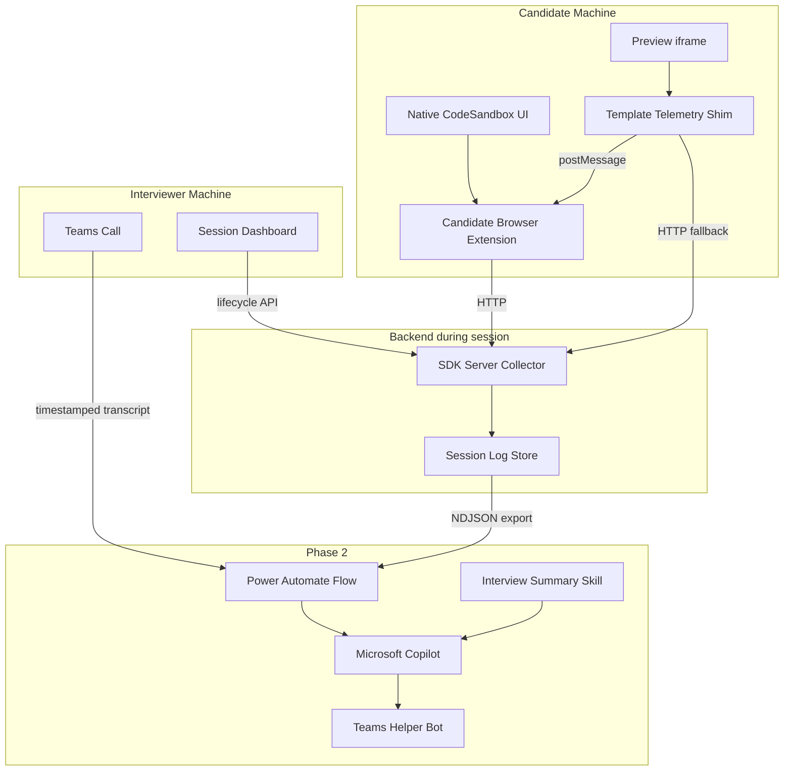
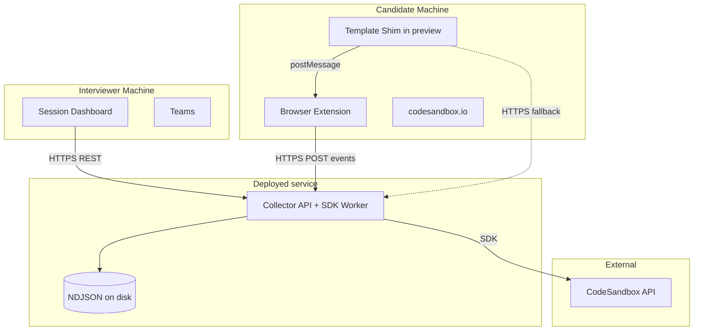
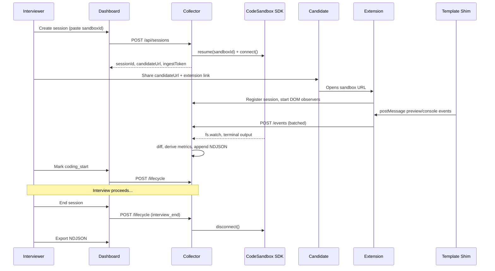
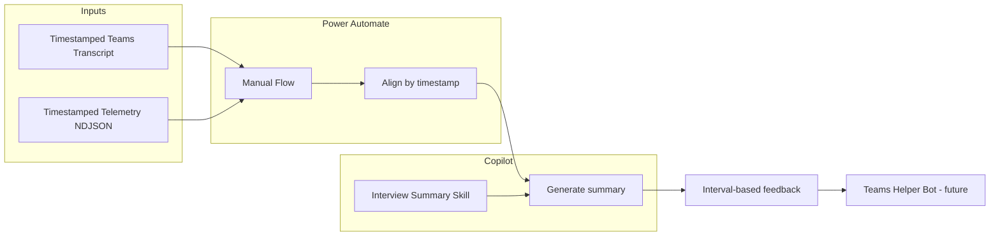

# CodeSandbox Interview Helper

Automatically capture timestamped telemetry from technical interviews conducted in CodeSandbox, so interviewers can generate detailed subjective summaries with **Microsoft Copilot** instead of taking manual notes every five minutes.

**Phase 1 goal:** produce a structured, timestamped log of everything that happened in the sandbox during an interview.

**Phase 2 goal:** combine those logs with a timestamped **Teams transcript** in a **Power Automate** flow that invokes **Copilot** (guided by an interview-summary skill) to produce interval-based subjective feedback. The same automation can later be exposed as a **helper Teams bot**.

---

## Table of contents

1. [Interview context](#interview-context)
2. [Problem](#problem)
3. [Goals and non-goals](#goals-and-non-goals)
4. [Architecture overview](#architecture-overview)
5. [Repository layout and builds](#repository-layout-and-builds)
6. [Deployment and communication](#deployment-and-communication)
7. [Data flow](#data-flow)
8. [User experience](#user-experience)
9. [Telemetry catalog](#telemetry-catalog)
10. [Signal extraction deep-dive](#signal-extraction-deep-dive)
11. [Log format](#log-format)
12. [Interview template contract](#interview-template-contract)
13. [Phase 2: Interview summary (Power Automate + Copilot)](#phase-2-interview-summary-power-automate--copilot)
14. [Known limitations and privacy](#known-limitations-and-privacy)
15. [Roadmap](#roadmap)
16. [References](#references)

---

## Interview context

A typical interview proceeds as follows:

1. The interviewer hosts a **Microsoft Teams** call with the candidate.
2. The interviewer shares a **CodeSandbox** they own with the candidate.
3. The candidate reads the **README** (problem statement), clarifies doubts, and explores the template code. Templates usually include React, HTML, and CSS scaffolding; the candidate is expected to implement logic (hooks, handlers, state, effects).
4. The candidate implements the solution while **explaining verbally**: state design, effects, handlers, state transitions, code structure, abstractions, and general coding practices.
5. Each problem has **milestones** implemented as Jest tests. Candidates run tests via CodeSandbox's **Run Tests** pane and visually validate through the **preview** section, debugging with the embedded DevTools and console as needed.

### What interviewers evaluate

Interviewers need a subjective summary at **five-minute intervals**, covering signals such as:

- Discussion quality and comprehension of the problem statement
- Code quality of changes made
- Debugging approach
- Navigation between files and components
- Interaction with the preview section
- Usage of DevTools (console, network, storage, sources)
- Bugs introduced or solved
- First-principles thinking and quality of questions asked

Writing these notes live is distracting and inevitably misses fine-grained signals (file diffs, preview clicks, tab switches, test runs).

---

## Problem

Manual note-taking every five minutes during a live call is:

- **Distracting** for the interviewer, who should be listening and probing
- **Incomplete** — tracking code changes, preview interactions, DevTools usage, and test runs in parallel is impractical
- **Low resolution** — without timestamps tied to specific actions, it is hard to reconstruct what the candidate did and when

This project automates collection of **timestamped CodeSandbox telemetry** that is later merged with a timestamped Teams transcript and processed by **Copilot** (via Power Automate) to generate interval-based interview summaries.

---

## Goals and non-goals

### Phase 1 goals — telemetry to capture

All of the following are in scope for Phase 1.

**Core signals:**

| # | Signal | Description |
|---|--------|-------------|
| 1 | File diffs | Timestamped diffs of file changes |
| 2 | File navigation | Movement between editor tabs and file explorer |
| 3 | Preview interactions | Clicks, inputs, focus inside the preview iframe only |
| 4 | Console logs | App `console.*` and terminal/shell output |
| 5 | DevTools activity | CodeSandbox embedded preview DevTools panels |
| 6 | Teams transcript integration | Timestamped transcript export; merged with telemetry in Power Automate (Phase 2) |

**Derived and behavioral signals:**

| # | Signal | Description |
|---|--------|-------------|
| 7 | Jest milestone runs | Activity in CodeSandbox **Run Tests** pane (primary), terminal fallback |
| 8 | Build / HMR errors | Compile and hot-reload failures from dev server output |
| 9 | TypeScript / lint errors | Problems panel and compiler/linter terminal output |
| 10 | README dwell time | Time from opening README to first code change in any file |
| 11 | Preview reload | Candidate refreshes preview to visually test |
| 12 | Idle vs active periods | Gaps with no activity (thinking time) |
| 13 | Editor search usage | Candidate uses editor search to navigate |
| 14 | Shell commands | `npm install`, test runs, and other terminal commands |
| 15 | Session lifecycle markers | Interviewer-defined phases (start, coding, end) |

### Non-goals (privacy and scope)

- **No screen recording**
- **No keystroke logging outside the preview iframe** — editor typing is inferred from file diffs only
- **No native Chrome DevTools (F12) instrumentation** — only CodeSandbox's embedded preview DevTools panels
- **No Copilot summarization in Phase 1** — Phase 1 output is raw telemetry logs only; summary generation is Phase 2 (Power Automate + Copilot)
- **No live Teams bot in Phase 1** — Phase 2 starts as a manual Power Automate flow; bot wrapper comes later

---

## Architecture overview

Candidates use the **native CodeSandbox web editor** (shared `codesandbox.io` link). Telemetry is collected by three components:

| Component | Where it runs | Needs CodeSandbox open? |
|-----------|---------------|------------------------|
| **SDK server collector** | Backend service | No |
| **Candidate browser extension** | Candidate's browser on `codesandbox.io` | Yes (candidate) |
| **Template telemetry shim** | Inside the sandbox preview app (npm package) | Yes (candidate) |
| **Session dashboard** | Interviewer's browser (web UI) | No |

The interviewer typically shares the sandbox link and may **close CodeSandbox**. All editor, preview, Run Tests, and DevTools UI runs on the **candidate's machine** — an interviewer-side extension cannot capture those signals.



### Component responsibilities

**SDK server collector** — Connects to the sandbox via the [CodeSandbox SDK](https://codesandbox.io/docs/sdk). Watches the filesystem, attaches to terminals, computes diffs, derives metrics (idle periods, README dwell), and persists events. Runs for the entire session once started; no browser required.

**Candidate browser extension** — Content script on `codesandbox.io` observes editor tabs, Run Tests pane, embedded DevTools, Problems panel, preview reload, and editor search. Relays `postMessage` events from the template shim to the collector API.

**Template telemetry shim** (`@interview-helper/template-shim`) — Published npm package imported in interview sandboxes. Captures preview interactions and app `console.*` output. See [packages/template-shim/README.md](packages/template-shim/README.md).

**Session dashboard** — React web UI for interviewers. Create/end sessions, mark interview phases, monitor health, export logs. Does not require CodeSandbox to be open.

**Phase 2 summary pipeline** — A **manual Power Automate** flow (later a **Teams bot**) takes the timestamped Teams transcript and the exported NDJSON telemetry, applies an **interview-summary skill** that defines how Copilot should write interval-based subjective feedback, and returns the summary to the interviewer. See [Phase 2](#phase-2-interview-summary-power-automate--copilot).

---

## Repository layout and builds

Yarn workspaces monorepo (TypeScript throughout).

```
codesandbox-interview-helper/
├── README.md
├── package.json                 # workspaces + "packageManager": "yarn@3.2.4"
├── .nvmrc                       # 25.8.2
├── .yarnrc.yml                  # nodeLinker: node-modules
├── yarn.lock
│
├── packages/
│   ├── shared/                  # @interview-helper/shared (internal)
│   │   ├── src/
│   │   │   ├── events.ts
│   │   │   ├── session.ts
│   │   │   └── api.ts
│   │   ├── tsconfig.json
│   │   └── package.json
│   │
│   └── template-shim/           # @interview-helper/template-shim (published npm)
│       ├── README.md
│       ├── src/
│       │   └── bootstrap.ts
│       ├── tsconfig.json
│       └── package.json
│
├── apps/
│   ├── collector/               # SDK server + REST API
│   ├── dashboard/               # Interviewer session UI (React)
│   └── extension/               # Candidate browser extension
│
├── sessions/                    # gitignored: <sessionId>/events.ndjson
│
└── skills/                      # Phase 2: Copilot skills (not runtime code)
    └── interview-summary/       # SKILL.md — interval-based subjective summary rubric
```

- **`packages/shared`** — Event schemas and API types. Internal only; not published.
- **`packages/template-shim`** — Published to npm. Interview templates add it as a dependency; source is **not copied** into template repos.
- **`apps/collector`**, **`apps/dashboard`**, **`apps/extension`** — Deployable/runtime modules described below.

### Toolchain

| Tool | Version |
|------|---------|
| Node | **25.8.2** (`.nvmrc`) |
| Yarn | **3.2.4** (`packageManager` in root `package.json`; enable via Corepack) |
| TypeScript compiler | **tsgo** (`@typescript/native-preview`) |
| Dashboard UI | **React** + **webpack** |

### Build tooling per module

**TypeScript:** [`tsgo`](https://www.npmjs.com/package/@typescript/native-preview) (`@typescript/native-preview`) replaces `tsc` across all workspaces.

**Bundling:** webpack bundles the React dashboard and browser extension entry points. tsgo handles compilation; webpack handles JSX and extension packaging.

| Module | Tooling | Output |
|--------|---------|--------|
| `packages/shared` | tsgo | `dist/*.js` + `.d.ts` |
| `packages/template-shim` | tsgo | `dist/` (published to npm) |
| `apps/collector` | tsgo | `dist/index.js` (Node) |
| `apps/dashboard` | tsgo + webpack + React | `dist/` static assets |
| `apps/extension` | tsgo + webpack | `dist/` unpacked extension |

### Root scripts

```bash
yarn build              # Build all workspaces (shared → template-shim → apps)
yarn dev                # Collector + dashboard concurrently
yarn dev:collector      # Collector API on :3001
yarn dev:dashboard      # Dashboard webpack-dev-server on :3000 (proxies /api → collector)
```

**Production:** Dashboard `webpack --mode production` output is served as static files from `apps/collector/public/`. The template-shim is published separately to npm on release. The extension is distributed via Chrome Web Store (unlisted) or internal sideloading.

---

## Deployment and communication

### v1 deployment model

One Node process (`apps/collector`) exposes:

| Endpoint | Purpose |
|----------|---------|
| `GET /` | Dashboard static UI |
| `POST /api/sessions` | Create session |
| `POST /api/sessions/:id/events` | Ingest events (extension + shim) |
| `POST /api/sessions/:id/lifecycle` | Phase markers (dashboard) |
| `GET /api/sessions/:id/status` | Health, event count, connection state |
| `GET /api/sessions/:id/export` | Download NDJSON |

**Environment variables:**

| Variable | Purpose |
|----------|---------|
| `CSB_API_KEY` | CodeSandbox SDK authentication |
| `COLLECTOR_PORT` | HTTP port (default `3001`) |
| `COLLECTOR_PUBLIC_URL` | Base URL for candidate links |
| `SESSIONS_DIR` | Directory for NDJSON output (default `./sessions`) |



### Inter-module communication

| From | To | Protocol | Payload |
|------|----|----------|---------|
| Dashboard | Collector | REST | Session create, lifecycle markers, status |
| Extension | Collector | REST (batched) | `{ events: [...] }` |
| Template shim | Extension | `postMessage` | Preview/console events |
| Template shim | Collector | REST (fallback) | Direct ingest if extension relay fails |
| Collector | CodeSandbox | SDK | `fs.watch`, `terminals.onOutput`, `commands.run` |
| Collector | Disk | In-process | Normalize, debounce, derive, append NDJSON |

**Session binding:** Creating a session returns:

- `sessionId` — UUID for the interview session
- `ingestToken` — secret for event POSTs (extension and shim send in `Authorization` header)
- `candidateUrl` — sandbox URL with `?telemetrySession=<sessionId>` appended

The extension reads `telemetrySession` from the URL on load and begins observation. Events are batched every 2–5 seconds (or 50 events). The collector preserves client `timestamp` and adds server-side `receivedAt`.

---

## Data flow



---

## User experience

### Interviewer

1. **Before interview**
   - Ensure the interview sandbox template lists `@interview-helper/template-shim` in `package.json` and imports the bootstrap in the entry file.
   - Prepare candidate extension install instructions.

2. **Session start**
   - Open the session dashboard (`https://collector.example.com` or `http://localhost:3001`).
   - Click **New Session**, paste the CodeSandbox sandbox ID.
   - Copy the **candidate link** (sandbox URL + `?telemetrySession=...`) and **extension install link**.
   - Share both with the candidate over Teams.

3. **During interview**
   - Stay on Teams. Optionally keep the dashboard open to monitor health (SDK connected, extension connected, event rate).
   - Click phase buttons: *Interview start*, *Problem explained*, *Coding started*, etc.
   - **CodeSandbox does not need to be open on the interviewer's machine.**

4. **After interview**
   - Click **End Session**.
   - Download the NDJSON telemetry export from the dashboard.
   - Export the **timestamped Teams transcript** (VTT or Teams transcript export).
   - Run the **Power Automate** flow (Phase 2): provide both files as inputs. Copilot returns the interval-based subjective summary.
   - Later: trigger the same flow from a **helper Teams bot** without leaving Teams.

### Candidate

1. **One-time setup**
   - Install the browser extension (Chrome/Edge) from the link provided by the interviewer.
   - Grant permission for `codesandbox.io`.

2. **Join interview**
   - Open the sandbox link shared by the interviewer (includes `?telemetrySession=...`).
   - Extension badge shows **Recording** when the session is active.

3. **During interview**
   - Use CodeSandbox normally: read README, edit files, run tests in the **Run Tests** pane, use preview and embedded DevTools.
   - No per-action steps required — collection runs in the background.

4. **If extension is missing**
   - Collector still receives SDK events (file diffs, terminal) and the shim may relay preview events via direct fetch.
   - Editor navigation, Run Tests pane, and DevTools panel telemetry will be **missing**. The dashboard shows a warning to the interviewer.

---

## Telemetry catalog

| Event type | Primary source | Fidelity |
|------------|----------------|----------|
| `file_diff` | SDK | High |
| `file_navigation` | Candidate extension | High (DOM-dependent) |
| `preview_interaction` | Template shim + extension | High |
| `console_log` | Template shim | High |
| `terminal_output` | SDK | High |
| `devtools_activity` | Candidate extension | Medium (embedded panels only) |
| `test_run` | Candidate extension (Run Tests pane) | High |
| `build_error` | SDK | Medium |
| `diagnostic_error` | Extension + SDK | Medium |
| `readme_dwell` | Derived (collector) | High |
| `preview_reload` | Candidate extension | High |
| `idle_period` | Derived (collector) | Medium |
| `search_usage` | Candidate extension | Medium |
| `shell_command` | SDK | Medium |
| `session_lifecycle` | Session dashboard | High |
| `telemetry_tamper` | Shim / extension | N/A |

---

## Signal extraction deep-dive

### 1. File diffs — SDK

**API:** [`client.fs.watch()`](https://codesandbox.io/docs/sdk/filesystem) with `{ recursive: true }`.

- Server-side collector calls `sdk.sandboxes.resume(sandboxId)` then `sandbox.connect()`.
- Maintain an in-memory snapshot of watched files.
- On watch event: read file, compute unified diff against snapshot, emit `file_diff`, update snapshot.
- Supplement with periodic `git diff` via [`client.commands.run()`](https://codesandbox.io/docs/sdk/commands).
- Debounce rapid saves (~500ms) to reduce noise.

**Limitation:** SDK sees persisted saves, not unsaved buffer content.

### 2. File navigation — candidate extension

The SDK has no editor tab/focus API for the native web editor.

- Extension content script on `codesandbox.io` observes tab bar and file explorer (`MutationObserver`, click listeners).
- Emit `file_navigation`: `{ from, to, trigger: "tab_click" | "explorer" | "collaborator_focus" }`.
- Fallback: infer working file from most recent `file_diff` per path.

### 3. Preview interactions — template shim + extension

SDK [`injectAndInvoke`](https://codesandbox.io/docs/sdk/browser-previews) only works when you own the preview iframe. In native CodeSandbox, use the published **`@interview-helper/template-shim`** package.

- Captures preview-only: `click`, `input`, `change`, `submit`, `focus`, `blur`, `scroll` with element descriptors (`tag`, `role`, `aria-label`, `data-testid`, truncated text, bounding rect).
- Does **not** capture keystrokes outside the preview iframe.
- Primary relay: `postMessage` → extension → collector.
- Fallback: shim `fetch()` directly to collector API.

### 4. Console logs — template shim + SDK

| Channel | Source | Method |
|---------|--------|--------|
| App `console.*` | Template shim | Hook and serialize safely ([console-feed](https://github.com/codesandbox/console-feed) pattern) |
| Terminal / dev server | SDK | [`client.terminals`](https://codesandbox.io/docs/sdk/terminals) + `terminal.onOutput()` |

Emit `console_log` (preview) and `terminal_output` (shell) as separate event types.

### 5. DevTools activity — candidate extension

Native Chrome DevTools (F12) cannot be instrumented. CodeSandbox's **embedded preview DevTools** (Console, Network, Application, Sources) can be observed from the candidate's browser.

- Emit `devtools_activity`: `{ panel, action, durationMs? }`.

### 6. Teams transcript — export + Power Automate merge (Phase 2)

**Phase 1:** Telemetry logs are exported as timestamped NDJSON from the session dashboard. The interviewer exports the **timestamped Teams transcript** after the call (Teams meeting recap / transcript download).

**Phase 2:** A **manual Power Automate** flow accepts both inputs:

1. Timestamped Teams transcript
2. Timestamped CodeSandbox telemetry dump (NDJSON export)

The flow aligns utterances and sandbox events on shared timestamps (using `session_lifecycle` markers as anchors where helpful) and passes the merged context to **Microsoft Copilot**, guided by the [interview-summary skill](#interview-summary-skill).

No standalone merge CLI — merging and summarization live in Power Automate + Copilot.

### 7. Jest milestone runs — candidate extension (Run Tests pane)

Milestones are Jest tests run in CodeSandbox's dedicated **Run Tests** pane — separate from the terminal. This pane shows per-file pass/fail, errors, watch mode, and a manual Play button.

**Primary (extension):**

- Detect Run Tests pane open/switch.
- Observe DOM: test file list, status icons, errors, watch toggle, Play click.
- Emit `test_run`: `{ trigger, testFile, status, failures? }`.

**Fallback (SDK):** Parse `terminal_output` for Jest CLI patterns if `npm test` is used in VM/cloud sandboxes.

### 8. Build / HMR errors — SDK

Attach to dev server terminal output. Pattern-match compile/HMR failures → `build_error`.

### 9. TypeScript / lint errors — extension + SDK

- Extension: observe Problems panel.
- SDK: parse `tsc` or eslint terminal output.
- Emit `diagnostic_error`: `{ source, severity, file, line, message }`.

### 10. README dwell time — derived

From `file_navigation` + `file_diff`:

- `readme_opened_at` — first navigation to README/problem file
- `first_change_at` — first `file_diff` in **any** file (components, hooks, utils, etc.)
- Exclude README paths from "first change" (configurable: `README.md`, `PROBLEM.md`)
- Emit `readme_dwell`: `{ durationMs, readmePath, firstChangePath }`

### 11. Preview reload — candidate extension

Observe preview toolbar refresh → `preview_reload`.

### 12. Idle vs active — derived

If no events for threshold (e.g. 60s), emit `idle_period`. Resume on next activity event.

### 13. Editor search — candidate extension

Detect search panel open and query execution → `search_usage` (omit query text if sensitive).

### 14. Shell commands — SDK

Pattern-match terminal output for `npm install`, `yarn add`, `npm test`, etc. → `shell_command`. Output parsing only; no keystroke capture.

### 15. Session lifecycle — session dashboard

Interviewer marks phases via dashboard (no CodeSandbox required): `interview_start`, `problem_explained`, `coding_start`, `interview_end`.

---

## Log format

Events are stored as **NDJSON** (one JSON object per line) in `sessions/<sessionId>/events.ndjson`.

### Envelope

Every event shares this structure:

```json
{
  "sessionId": "550e8400-e29b-41d4-a716-446655440000",
  "timestamp": "2026-07-23T08:05:12.341Z",
  "receivedAt": "2026-07-23T08:05:12.398Z",
  "type": "file_diff",
  "source": "sdk",
  "payload": { }
}
```

| Field | Description |
|-------|-------------|
| `sessionId` | Interview session UUID |
| `timestamp` | When the event occurred (client or SDK origin) |
| `receivedAt` | When the collector persisted the event (server) |
| `type` | Event type (see telemetry catalog) |
| `source` | `sdk` \| `extension` \| `template` \| `dashboard` \| `derived` |
| `payload` | Type-specific data |

### Example session excerpt

```json
{"sessionId":"abc","timestamp":"2026-07-23T08:00:00.000Z","receivedAt":"2026-07-23T08:00:00.012Z","type":"session_lifecycle","source":"dashboard","payload":{"phase":"interview_start"}}
{"sessionId":"abc","timestamp":"2026-07-23T08:01:15.200Z","receivedAt":"2026-07-23T08:01:15.210Z","type":"file_navigation","source":"extension","payload":{"from":null,"to":"README.md","trigger":"explorer"}}
{"sessionId":"abc","timestamp":"2026-07-23T08:04:32.100Z","receivedAt":"2026-07-23T08:04:32.115Z","type":"file_diff","source":"sdk","payload":{"path":"src/App.tsx","changeType":"modified","diff":"@@ -1,5 +1,8 @@\n..."}}
{"sessionId":"abc","timestamp":"2026-07-23T08:04:32.105Z","receivedAt":"2026-07-23T08:04:32.200Z","type":"readme_dwell","source":"derived","payload":{"durationMs":196900,"readmePath":"README.md","firstChangePath":"src/App.tsx"}}
{"sessionId":"abc","timestamp":"2026-07-23T08:06:01.500Z","receivedAt":"2026-07-23T08:06:01.510Z","type":"test_run","source":"extension","payload":{"trigger":"manual_play","testFile":"src/milestone1.test.ts","status":"fail","failures":[{"name":"renders counter","message":"Expected 1, received 0"}]}}
{"sessionId":"abc","timestamp":"2026-07-23T08:06:45.000Z","receivedAt":"2026-07-23T08:06:45.008Z","type":"preview_interaction","source":"template","payload":{"action":"click","element":{"tag":"button","role":"button","text":"Increment"}}}
{"sessionId":"abc","timestamp":"2026-07-23T08:07:10.300Z","receivedAt":"2026-07-23T08:07:10.315Z","type":"console_log","source":"template","payload":{"level":"log","args":["count:",1]}}
{"sessionId":"abc","timestamp":"2026-07-23T08:08:00.000Z","receivedAt":"2026-07-23T08:08:00.005Z","type":"devtools_activity","source":"extension","payload":{"panel":"network","action":"tab_switch"}}
{"sessionId":"abc","timestamp":"2026-07-23T08:10:00.000Z","receivedAt":"2026-07-23T08:10:00.003Z","type":"test_run","source":"extension","payload":{"trigger":"auto_watch","testFile":"src/milestone1.test.ts","status":"pass"}}
{"sessionId":"abc","timestamp":"2026-07-23T08:12:30.000Z","receivedAt":"2026-07-23T08:12:30.002Z","type":"idle_period","source":"derived","payload":{"start":"2026-07-23T08:11:00.000Z","end":"2026-07-23T08:12:30.000Z","durationMs":90000}}
```

---

## Interview template contract

Interview problem templates depend on the **published npm package** — do not copy shim source into template repos.

**`package.json`:**

```json
{
  "dependencies": {
    "@interview-helper/template-shim": "^1.0.0"
  }
}
```

**Entry file (e.g. `src/main.tsx`):**

```ts
import "@interview-helper/template-shim/bootstrap";
```

**Configuration:** Set `TELEMETRY_SESSION`, `TELEMETRY_COLLECTOR_URL`, and `TELEMETRY_INGEST_TOKEN` in the CodeSandbox sandbox environment. See [packages/template-shim/README.md](packages/template-shim/README.md) for full setup.

**Interviewer checklist:**

- [ ] Template has `@interview-helper/template-shim` dependency
- [ ] Bootstrap import is present in entry file
- [ ] Telemetry env var is documented for session binding
- [ ] Candidate extension install link is ready

---

## Phase 2: Interview summary (Power Automate + Copilot)

Phase 1 produces two timestamped inputs. Phase 2 combines them into the subjective, five-minute-interval summary interviewers need — without manual note-taking during the call.

### Overview



### Manual Power Automate flow (v1)

A **manually triggered** Power Automate flow the interviewer runs after each interview:

| Step | Action |
|------|--------|
| 1 | Interviewer uploads or selects the Teams timestamped transcript |
| 2 | Interviewer uploads the NDJSON export from the session dashboard |
| 3 | Flow normalizes both into a single time-ordered context (utterances + telemetry events) |
| 4 | Flow invokes **Copilot** with the merged input and the interview-summary skill |
| 5 | Copilot returns structured feedback in **five-minute intervals** |
| 6 | Flow delivers output (email, Teams chat, SharePoint, etc.) |

The flow is intentionally manual at first so interviewers can review inputs before generation.

### Interview summary skill

A **Copilot skill** (stored in this repo under `skills/interview-summary/`) instructs Copilot how to write the subjective summary. The skill defines:

- **Output structure** — one section per five-minute window (aligned to interview timeline)
- **Rubric dimensions** — discussion quality, code quality, debugging approach, file navigation, preview usage, DevTools usage, bugs introduced/solved, comprehension, first-principles thinking, quality of questions asked
- **How to correlate** — map verbal explanations in the transcript to code changes, test runs, and preview interactions in the telemetry
- **Tone and constraints** — objective, evidence-based, cite timestamps; flag gaps when telemetry or transcript is incomplete

Example skill prompt excerpt (full skill in `skills/interview-summary/SKILL.md` when implemented):

> For each five-minute interval, produce a subjective assessment grounded in both what the candidate said (transcript) and what they did (telemetry). Reference specific events — e.g. "at 08:06 opened Run Tests pane, milestone 1 failed" — rather than generic praise or criticism.

### Microsoft Copilot as the LLM

Summary generation uses **Microsoft Copilot** (not a separate LLM API). Power Automate orchestrates the call; the skill provides domain-specific instructions Copilot would not infer on its own.

### Evolution: helper Teams bot

The same Power Automate flow can be wrapped as a **Teams bot** so interviewers can:

- Upload transcript + telemetry (or link to dashboard export) in a Teams chat
- Receive the interval-based summary in-thread
- Re-run or refine without leaving Teams

The bot reuses the identical merge logic and Copilot skill — only the trigger and delivery channel change.

### Phase 1 → Phase 2 handoff

| Artifact | Produced by | Consumed by |
|----------|-------------|-------------|
| `sessions/<id>/events.ndjson` | Session dashboard export | Power Automate flow |
| Timestamped Teams transcript | Teams meeting export | Power Automate flow |
| Interview summary | Copilot (via skill) | Interviewer / hiring team |

Ensure telemetry timestamps are ISO-8601 and transcript lines include timestamps so Power Automate can align them without ad-hoc parsing.

---

## Known limitations and privacy

| Limitation | Impact | Mitigation |
|------------|--------|------------|
| Candidate must install extension | UI telemetry missing without it | Clear setup docs; dashboard warning |
| CodeSandbox DOM changes | Extension selectors may break | Versioned selectors; graceful degradation |
| SDK sees saves only | Unsaved edits invisible | Acceptable for interviews; debounce diffs |
| Embedded DevTools only | F12 usage not tracked | Document in interviewer guide |
| Multiplayer editing | Author attribution unclear | `authorHint` where available; else `unknown` |
| tsgo preview maturity | Some `tsc` features missing | Fall back to `typescript` package if needed |
| Shim tampering | Candidate removes import | `telemetry_tamper` event; pre-interview checklist |

**Privacy rules enforced in implementation:**

- No screen recording
- No keystroke logging outside the preview iframe
- Redact or truncate sensitive console payloads
- Do not log password field values from preview interactions
- Editor activity inferred from file diffs only

---

## Roadmap

| Phase | Deliverable |
|-------|-------------|
| 0 | README + `packages/shared` schema + `packages/template-shim/README.md` |
| 1 | `apps/collector` — SDK watcher, REST API, NDJSON store |
| 2 | `apps/dashboard` — session create, lifecycle markers, export |
| 3 | `apps/extension` — candidate-side DOM observers + event relay |
| 4 | `packages/template-shim` — build, publish to npm, bootstrap + postMessage |
| 5 | Derived metrics pipeline (idle, readme_dwell, shell parsing) |
| 6 | Power Automate flow + Copilot interview-summary skill (`skills/interview-summary/`) |
| 7 | Teams helper bot wrapping the same automate flow |

---

## References

- [CodeSandbox SDK overview](https://codesandbox.io/docs/sdk)
- [File System API (`fs.watch`)](https://codesandbox.io/docs/sdk/filesystem)
- [Commands API](https://codesandbox.io/docs/sdk/commands)
- [Terminals API](https://codesandbox.io/docs/sdk/terminals)
- [Browser Previews (`injectAndInvoke`)](https://codesandbox.io/docs/sdk/browser-previews)
- [Clients and sessions](https://codesandbox.io/docs/sdk/clients)
- [CodeSandbox Tests (legacy browser sandboxes)](https://codesandbox.io/docs/learn/legacy-sandboxes/test)
- [@interview-helper/template-shim usage](packages/template-shim/README.md)
